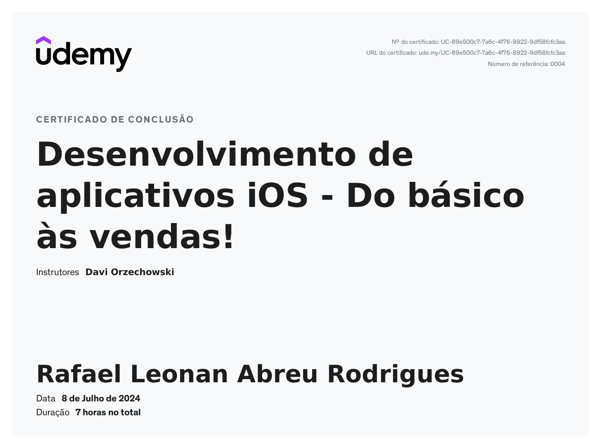

# Desenvolvimento de aplicativos iOS

## Descrição

Curso de programação mobile para IOS nativo.

## Curso

**Desenvolvimento de aplicativos iOS - Do básico às vendas!**

[Link para o curso na Udemy](https://www.udemy.com/course/davi_ios/)

## Conteúdo do curso

- Programar aplicativos para iOS na linguagem Swift, utilizando a biblioteca UIKit da Apple.

- Organizar suas idéias e planejar um aplicativo.

- Publicar um aplicativo na App Store.

- Analisar resultados estatísticos de aplicativos.

- Analisar oportunidades de monetização de aplicativos.

## Certificado

